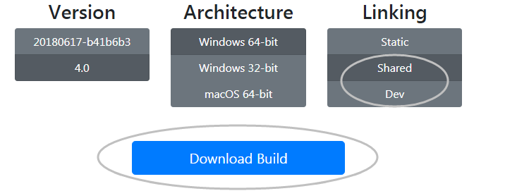
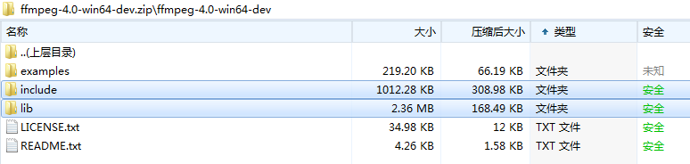
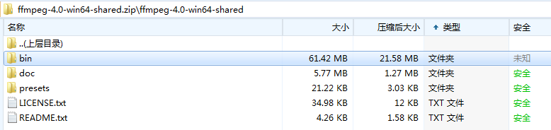
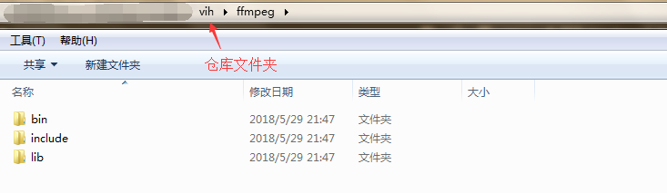
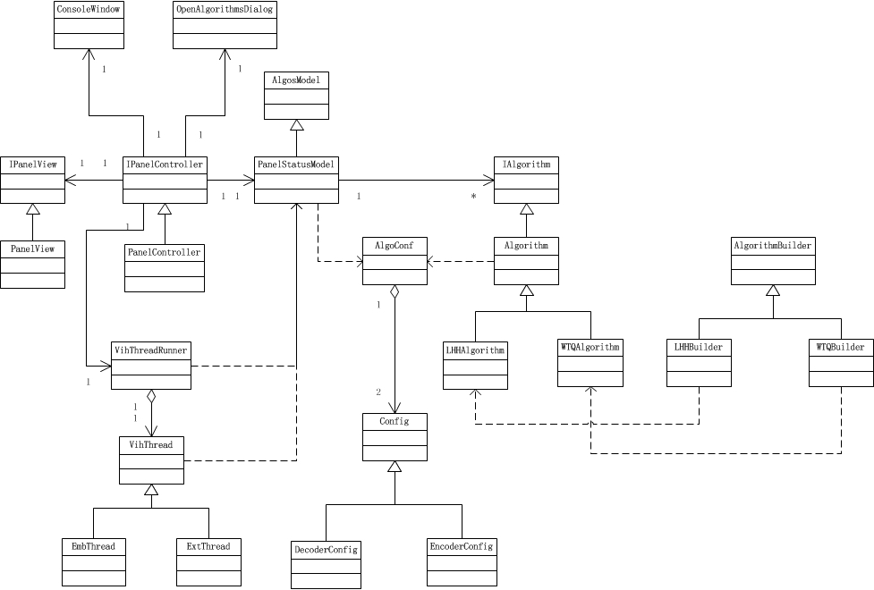

# 开发文档

## 一、开发环境
* Windows 64bit
* Visual Studio 2013

### 1.*Qt 5.8*
引用Qt官网的介绍：
>Easily create connected devices, UIs and applications with native C++ performance. It’s powerful, yet compact, has intuitive tools and libraries and will blow your mind!

Qt编写的工程是无法直接通过C++直接编译的，需要通过Qt进行预编译。Qt Creater是一款轻量级的Qt-IDE，对Qt的预编译支持非常好，但是由于Qt Creater的调试效率不及Visual Studio，因此为了让Visual Studio支持Qt预编译及其他Qt功能，需要在Visual Studio上安装Qt插件。

对于Visual Studio上进行Qt的编译，请参考这篇[博文](https://blog.csdn.net/goodtomsheng/article/details/45719205)。需要注意的是该博文采用的是Qt5.4,建议安装`Qt5.8`。
### 2.*FFmpeg 4.0*
FFmpeg是一款基于C/C++的跨平台的多媒体处理方案，提供了用于C/C++开发多媒体的第三方组件库。当前产品采用了FFmpeg读取多媒体数据信息，提取音视频文件、封装多媒体文件等。
#### 1).下载
在[这里](https://ffmpeg.zeranoe.com/builds/)进入FFmpeg的下载页，并且选择[4.0-Win64-Shared]和[4.0-Win64-Dev]两款进行下载。



将Dev版本中的include文件夹和lib文件夹移动到本仓库的ffmpeg文件夹(若该文件夹不存在，请`新建ffmpeg文件夹`)下。



将Shared版本的bin文件夹移动到本仓库的ffmpeg文件夹下。



最终的ffmpeg文件夹如下图所示：



#### 2).配置与使用
##### a.头文件
工程[属性]->[配置属性]->[C/C++]->[常规]的`附加包含目录`中添加ffmpeg的include文件夹。
##### b.静态库
工程[属性]->[配置属性]->[链接器]->[常规]的`附加库目录`中添加ffmpeg的lib文件夹。

工程[属性]->[配置属性]->[链接器]->[输入]的`附加依赖项`中添加ffmpeg的lib文件：
```
avcodec.lib
avdevice.lib
avfilter.lib
avformat.lib
avutil.lib
postproc.lib
swresample.lib
swscale.lib
```
##### c.动态库
系统环境变量PATH中直接添加动态库目录`ffmpeg/bin`
### 3.*K-Lite Codec Pack*
Qt界面在进行视频播放的时候，需要选择视频解码器，当前产品采用`K-Lite`作为视频播放的解码器。点击[这里](http://www.codecguide.com/download_k-lite_codec_pack_standard.htm)，进入K-Lite的下载页面，请下载并安装。


## 二、UML


## 三、机制详解
### 1.*信息隐藏和提取框架*
### 2.*MVC架构*
### 3.*算法文件*
### 4.*线程调用*
### 5.*进程管理*
### 6.*配置文件*
### 7.*动态加载*

## 下个版本需要考虑提供以下功能
* 1.提供对avi/rmvb/...更多种类视频的支持
* 2.生成视频H.264分辨率的YUV(宽高均为16的倍数)。
* 3.添加media播放的进度条。
* 4.解决提取的YUV文件不能进行正常的JM编码。
* 5.添加性能指标
* 6.media转yuv掉首帧问题